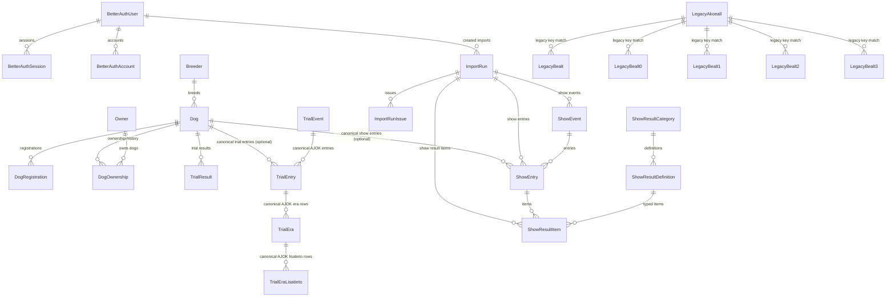

# Database Schema (Full)

This document describes the full Prisma schema in
`packages/db/prisma/schema.prisma`.

For show-domain deep details, see:
[show-schema.md](/Users/akikuivas/personal-projects/beagle/beagle-app-v2/docs/features/schema/show-schema.md).

## Enums

- `Role`: `USER`, `ADMIN`
- `DogSex`: `MALE`, `FEMALE`, `UNKNOWN`
- `ImportKind`: `LEGACY_PHASE1`, `LEGACY_PHASE1_5`, `LEGACY_PHASE3`, `LEGACY_TRIAL_MIRROR`, `LEGACY_PHASE5`
- `ImportStatus`: `PENDING`, `RUNNING`, `SUCCEEDED`, `FAILED`
- `ImportIssueSeverity`: `INFO`, `WARNING`, `ERROR`
- `ShowSourceTag`: source tagging for legacy/workbook/manual show data
- `TrialSourceTag`: source tagging for canonical trial entry writes
- `ShowResultValueType`: `FLAG`, `CODE`, `TEXT`, `NUMERIC`, `DATE`
- `AuditAction`: `INSERT`, `UPDATE`, `DELETE`
- `AuditSource`: `WEB`, `SCRIPT`, `SYSTEM`

## Domain map

## Models

### Auth

- `BetterAuthUser`: user identity, role, moderation flags.
- `BetterAuthSession`: session tokens linked to user (`onDelete: Cascade`).
- `BetterAuthAccount`: provider account links (`providerId + accountId` unique).
- `BetterAuthVerification`: verification tokens (`identifier + value` unique).

### Core dog data

- `Dog`: central dog entity (pedigree links, breeder link, timestamps).
- `DogRegistration`: unique registration numbers per dog.
- `Breeder`: breeder registry and metadata.
- `Owner`: normalized owner identity (`name + postalCode + city` unique).
- `DogOwnership`: ownership history by date key; unique
  `[dogId, ownerId, ownershipDateKey]`.

### Results

- `TrialResult`: canonical trial rows keyed by unique `sourceKey`.
- `TrialEvent`: canonical AJOK trial event (new schema event level).
- `TrialEntry`: canonical AJOK trial dog entry (new schema entry level).
  - `TrialEntry` stores the direct summary/core fields for one dog in one event.
  - `TrialEntry.ke` stores the top-level weather/condition value from source
    `KELI` / legacy `KE`.
- `TrialEra`: canonical AJOK era row per `trialEntryId + era`.
- `TrialEraLisatieto`: canonical AJOK lisatieto row per
  `trialEraId + koodi + osa`.
  - `TrialEra` stores per-era timing and score fields.
  - `TrialEraLisatieto` stores detailed code rows such as `10-62` for report/PDF
    rendering without decoding raw payload JSON.
  - `TrialEraLisatieto.osa` is empty for normal one-value codes and stores a
    subpart key such as `a`, `b`, or `c` when one official code has multiple
    values for the same era.
- `LegacyAkoeall`, `LegacyBealt`, `LegacyBealt0`, `LegacyBealt1`,
  `LegacyBealt2`, `LegacyBealt3`: frozen v1 AJOK mirror tables used for
  source validation and later projection into canonical runtime tables.
  These tables preserve the legacy composite keys and source column names via
  Prisma mappings, store legacy `MUOKATTU` as raw text to support zero-date
  values, and include import metadata (`rawPayloadJson`, `sourceHash`,
  `importedAt`). Runtime application reads should not use these tables directly.
- `ShowEvent`: canonical show event.
- `ShowEntry`: canonical show participation row; `dogId` nullable.
- `ShowResultCategory`: UI/admin managed grouping for show definitions.
- `ShowResultDefinition`: definition catalog (code + labels + value type).
- `ShowResultItem`: flexible value items connected to entry + definition.

### Import and audit

- `ImportRun`: import execution aggregate, counters, status lifecycle.
- `ImportRunIssue`: structured warnings/errors per run/stage/code.
- `AuditEvent`: append-only audit trail for row-level changes.

## Relation and delete semantics

- `BetterAuthUser -> BetterAuthSession/BetterAuthAccount`: `Cascade`
- `BetterAuthUser -> ImportRun(createdByUser)`: `SetNull`
- `Dog -> DogRegistration/DogOwnership/TrialResult`: `Cascade`
- `Dog -> TrialEntry`: `SetNull` (allows trial rows without local dog)
- `TrialEvent -> TrialEntry`: `Cascade`
- `TrialEntry -> TrialEra`: `Cascade`
- `TrialEra -> TrialEraLisatieto`: `Cascade`
- `Dog -> ShowEntry`: `SetNull` (allows show rows without local dog)
- `ShowEvent -> ShowEntry`: `Cascade`
- `ShowEntry -> ShowResultItem`: `Cascade`
- `ShowResultDefinition -> ShowResultItem`: `Restrict`
- `ShowResultCategory -> ShowResultDefinition`: `Restrict`
- `ImportRun -> ImportRunIssue`: `Cascade`
- `ImportRun -> ShowEvent/ShowEntry/ShowResultItem`: `SetNull`

## Identity and unique constraints (key ones)

- `Dog.ekNo` unique
- `DogRegistration.registrationNo` unique
- `TrialResult.sourceKey` unique
- `TrialEvent.sklKoeId` unique (nullable in legacy phase2 fallback)
- `TrialEvent.legacyEventKey` unique (nullable, used for legacy fallback identity)
- `TrialEntry.yksilointiAvain` unique
- `TrialEntry.[trialEventId, rekisterinumeroSnapshot]` unique
- `TrialEra.[trialEntryId, era]` unique
- `TrialEraLisatieto.[trialEraId, koodi, osa]` unique
- `LegacyAkoeall.[REKNO, TAPPA, TAPPV]` composite primary key
- `LegacyBealt*.[REKNO, TAPPA, TAPPV, ERA]` composite primary key
- `ShowEvent.eventLookupKey` unique
- `ShowEntry.entryLookupKey` unique
- `ShowResultItem.itemLookupKey` unique
- `ShowResultCategory.code` unique
- `ShowResultDefinition.code` unique

Optional source dedupe hashes:

- `ShowEvent.sourceRowHash` unique when present
- `ShowEntry.sourceRowHash` unique when present
- `ShowResultItem.sourceRowHash` unique when present

Clarification:

- `*LookupKey` is the main business key used in upserts.
- `sourceRowHash` is a fingerprint of the raw source row.
- `sourceRef` is a readable trace reference for people.
- `sourceTag` tells which source family the row came from.

## Index strategy (high level)

- Dog/search indexes: name, sex, birth date, pedigree links.
- Ownership indexes: by dog, owner, ownershipDate.
- Results indexes: by event date and dog-date combinations.
- Import indexes: by run kind/status and issue severity/code.
- Show canonical indexes:
  - events by date/place/source
  - entries by event/dog/source
  - result items by entry/definition/source

## Show model note

- Canonical show model is `ShowEvent` + `ShowEntry` + `ShowResultItem`
  with `ShowResultDefinition`/`ShowResultCategory` metadata.
