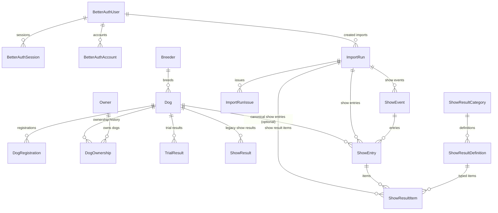

# Database Schema (Full)

This document describes the full Prisma schema in
`packages/db/prisma/schema.prisma`.

For show-domain deep details, see:
[show-schema.md](/Users/akikuivas/personal-projects/beagle/beagle-app-v2/docs/features/schema/show-schema.md).

## Enums

- `Role`: `USER`, `ADMIN`
- `DogSex`: `MALE`, `FEMALE`, `UNKNOWN`
- `ImportKind`: `LEGACY_PHASE1`, `LEGACY_PHASE2`, `LEGACY_PHASE3`
- `ImportStatus`: `PENDING`, `RUNNING`, `SUCCEEDED`, `FAILED`
- `ImportIssueSeverity`: `INFO`, `WARNING`, `ERROR`
- `ShowSourceTag`: source tagging for legacy/workbook/manual show data
- `ShowResultValueType`: `FLAG`, `CODE`, `TEXT`, `NUMERIC`, `DATE`
- `AuditAction`: `INSERT`, `UPDATE`, `DELETE`
- `AuditSource`: `WEB`, `SCRIPT`, `SYSTEM`

## Domain map

## Models

### Auth

- `BetterAuthUser`: user identity, role, moderation flags.
- `BetterAuthSession`: session tokens linked to user (`onDelete: Cascade`).
- `BetterAuthAccount`: provider account links (`providerId + accountId` unique).
- `BetterAuthVerification`: verification tokens (`identifier + value` unique).

### Core dog data

- `Dog`: central dog entity (pedigree links, breeder link, timestamps).
- `DogRegistration`: unique registration numbers per dog.
- `Breeder`: breeder registry and metadata.
- `Owner`: normalized owner identity (`name + postalCode + city` unique).
- `DogOwnership`: ownership history by date key; unique
  `[dogId, ownerId, ownershipDateKey]`.

### Results

- `TrialResult`: canonical trial rows keyed by unique `sourceKey`.
- `ShowResult`: legacy show result table keyed by unique `sourceKey`.
- `ShowEvent`: canonical show event.
- `ShowEntry`: canonical show participation row; `dogId` nullable.
- `ShowResultCategory`: UI/admin managed grouping for show definitions.
- `ShowResultDefinition`: definition catalog (code + labels + value type).
- `ShowResultItem`: flexible value items connected to entry + definition.

### Import and audit

- `ImportRun`: import execution aggregate, counters, status lifecycle.
- `ImportRunIssue`: structured warnings/errors per run/stage/code.
- `AuditEvent`: append-only audit trail for row-level changes.

## Relation and delete semantics

- `BetterAuthUser -> BetterAuthSession/BetterAuthAccount`: `Cascade`
- `BetterAuthUser -> ImportRun(createdByUser)`: `SetNull`
- `Dog -> DogRegistration/DogOwnership/TrialResult/ShowResult`: `Cascade`
- `Dog -> ShowEntry`: `SetNull` (allows show rows without local dog)
- `ShowEvent -> ShowEntry`: `Cascade`
- `ShowEntry -> ShowResultItem`: `Cascade`
- `ShowResultDefinition -> ShowResultItem`: `Restrict`
- `ShowResultCategory -> ShowResultDefinition`: `Restrict`
- `ImportRun -> ImportRunIssue`: `Cascade`
- `ImportRun -> ShowEvent/ShowEntry/ShowResultItem`: `SetNull`

## Identity and unique constraints (key ones)

- `Dog.ekNo` unique
- `DogRegistration.registrationNo` unique
- `TrialResult.sourceKey` unique
- `ShowResult.sourceKey` unique (legacy table)
- `ShowEvent.eventLookupKey` unique
- `ShowEntry.entryLookupKey` unique
- `ShowResultItem.itemLookupKey` unique
- `ShowResultCategory.code` unique
- `ShowResultDefinition.code` unique

Optional source dedupe hashes:

- `ShowEvent.sourceRowHash` unique when present
- `ShowEntry.sourceRowHash` unique when present
- `ShowResultItem.sourceRowHash` unique when present

## Index strategy (high level)

- Dog/search indexes: name, sex, birth date, pedigree links.
- Ownership indexes: by dog, owner, ownershipDate.
- Results indexes: by event date and dog-date combinations.
- Import indexes: by run kind/status and issue severity/code.
- Show canonical indexes:
  - events by date/place/source
  - entries by event/dog/source
  - result items by entry/definition/source

## Legacy and cutover note

- `ShowResult` exists as legacy read/write model during cutover.
- Canonical show model is `ShowEvent` + `ShowEntry` + `ShowResultItem`
  with `ShowResultDefinition`/`ShowResultCategory` metadata.
