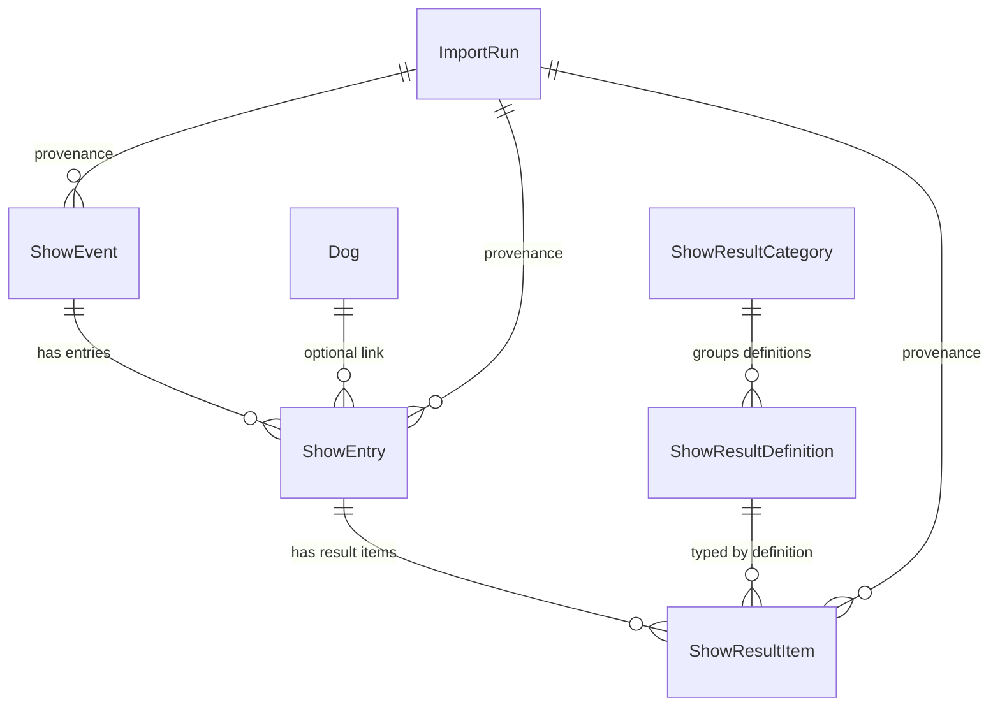

# Show Schema (Canonical)

This document is the full reference for canonical show schema in
`packages/db/prisma/schema.prisma`.

## Relation map



## Model reference

### `ShowEvent`

- Identity:
  - `id` (technical PK)
  - `eventLookupKey` (unique canonical lookup key)
  - `sourceRowHash` (optional unique source fingerprint)
- Core fields:
  - `sourceTag`
  - `eventDate`
  - `eventName`
  - `eventCity`
  - `eventPlace`
  - `eventType`
  - `organizer`
- Provenance:
  - `importRunId`
  - `sourceTable`
  - `sourceRef`
  - `rawPayloadJson`
- Relations:
  - `importRun` (optional)
  - `entries` (1:N to `ShowEntry`)

### `ShowEntry`

- Identity:
  - `id` (technical PK)
  - `entryLookupKey` (unique canonical lookup key)
  - `sourceRowHash` (optional unique source fingerprint)
- Links:
  - `showEventId` (required FK to `ShowEvent`)
  - `dogId` (optional FK to `Dog`, nullable by design)
- Snapshot and parsed fields:
  - `registrationNoSnapshot`
  - `dogNameSnapshot`
  - `judge`
  - `heightText`
  - `critiqueText`
- Provenance:
  - `importRunId`
  - `sourceTable`
  - `sourceRef`
  - `legacyFlag`
  - `rawPayloadJson`
- Relations:
  - `showEvent` (N:1)
  - `dog` (N:1 optional)
  - `importRun` (N:1 optional)
  - `resultItems` (1:N to `ShowResultItem`)

### `ShowResultCategory`

- Identity:
  - `id` (technical PK)
  - `code` (unique category code)
- Labels and behavior:
  - `labelFi`, `labelSv`
  - `descriptionFi`, `descriptionSv`
  - `sortOrder`
  - `isEnabled`
- Relations:
  - `definitions` (1:N to `ShowResultDefinition`)

### `ShowResultDefinition`

- Identity:
  - `id` (technical PK)
  - `code` (unique definition code, for example `ERI`, `SA`, `PUPN`)
- Labels and behavior:
  - `labelFi`, `labelSv`
  - `descriptionFi`, `descriptionSv`
  - `valueType`
  - `sortOrder`
  - `isVisibleByDefault`
  - `isEnabled`
- Category link:
  - `categoryId` (required FK to `ShowResultCategory`)
- Relations:
  - `category` (N:1)
  - `resultItems` (1:N to `ShowResultItem`)

### `ShowResultItem`

- Identity:
  - `id` (technical PK)
  - `itemLookupKey` (unique canonical lookup key)
  - `sourceRowHash` (optional unique source fingerprint)
- Links:
  - `showEntryId` (required FK to `ShowEntry`)
  - `definitionId` (required FK to `ShowResultDefinition`)
- Value payload:
  - `sourceTag`
  - `valueCode`
  - `valueText`
  - `valueNumeric`
  - `valueDate`
  - `isAwarded`
- Provenance:
  - `importRunId`
  - `sourceTable`
  - `sourceRef`
  - `rawPayloadJson`
- Relations:
  - `showEntry` (N:1)
  - `definition` (N:1)
  - `importRun` (N:1 optional)

## Lookup keys (main focus)

### `eventLookupKey`

Stable identity for one canonical show event.

- Intended use: `upsert` key for `ShowEvent`
- Typical construction principle:
  - canonical date part
  - canonicalized place key

### `entryLookupKey`

Stable identity for one dog in one event.

- Intended use: `upsert` key for `ShowEntry`
- Typical construction principle:
  - registration key
  - `eventLookupKey`

### `itemLookupKey`

Stable identity for one definition/value item on one entry.

- Intended use: `upsert` key for `ShowResultItem`
- Typical construction principle:
  - `entryLookupKey`
  - definition code/id
  - optional value discriminator when needed

### `sourceRowHash`

Strict source-row fingerprint. Use only for dedupe/provenance semantics.

- Do not use as the primary business identity.
- Keep `*LookupKey` fields as canonical business keys.

## Concrete data example

Legacy source row example:

```json
{
  "REKNO": "FI43443/17",
  "TAPPV": "2023-04-22",
  "TAPPA": "Pello",
  "TULNI": "H",
  "TUOM1": "TSCHOKKINEN JETTA"
}
```

Canonical event + entry + items mapping example:

```json
{
  "importRunId": "cmmqp7glq00001sl9njt8n3pt",
  "showEvent": {
    "eventLookupKey": "2023-04-22|PELLO",
    "sourceTag": "LEGACY_NAY9599",
    "eventDate": "2023-04-22T00:00:00.000Z",
    "eventCity": null,
    "eventPlace": "Pello",
    "sourceTable": "nay9599",
    "sourceRef": "FI43443/17|2023-04-22|Pello",
    "importRunId": "cmmqp7glq00001sl9njt8n3pt"
  },
  "showEntry": {
    "entryLookupKey": "FI43443/17|2023-04-22|PELLO",
    "showEventLookupKey": "2023-04-22|PELLO",
    "dogId": "cmmqkruyg39zgwdl9hfvn6qq7",
    "registrationNoSnapshot": "FI43443/17",
    "dogNameSnapshot": "VUOPAJAN WONKALE",
    "judge": "TSCHOKKINEN JETTA",
    "sourceTable": "nay9599",
    "sourceRef": "FI43443/17|2023-04-22|Pello",
    "importRunId": "cmmqp7glq00001sl9njt8n3pt"
  },
  "showResultItems": [
    {
      "itemLookupKey": "FI43443/17|2023-04-22|PELLO|H|flag|1",
      "definitionCode": "H",
      "isAwarded": true
    }
  ]
}
```

Notes:

- This concrete row has one item only: definition `H` with `isAwarded=true`.
- Class and quality are modeled via `ShowResultItem` definitions (for example
  `JUN`, `NUO`, `AVO`, `KÄY`, `VAL`, `VET`, `ERI`, `EH`) instead of dedicated
  `ShowEntry` columns.
- `PUPN` still stays as one definition in this schema, and rank goes to
  `valueCode` (`PU1`, `PN2`) when that result exists in source data.
- If dog is not found locally, entry is still accepted (`dogId = null`).
- If a definition code does not exist in `ShowResultDefinition`, import should
  fail fast in preflight definition check before row upserts.

## Delete semantics

- `ShowEvent -> ShowEntry`: `Cascade`
- `ShowEntry -> ShowResultItem`: `Cascade`
- `ShowEntry -> Dog`: `SetNull`
- `ShowEvent/ShowEntry/ShowResultItem -> ImportRun`: `SetNull`
- `ShowResultItem -> ShowResultDefinition`: `Restrict`
- `ShowResultDefinition -> ShowResultCategory`: `Restrict`

## Canonical vs legacy read model

- Canonical show import target:
  - `ShowEvent`
  - `ShowEntry`
  - `ShowResultItem`
- Legacy table `ShowResult` may still exist during cutover, but it is not the
  canonical model for phase3 canonical ingestion.
